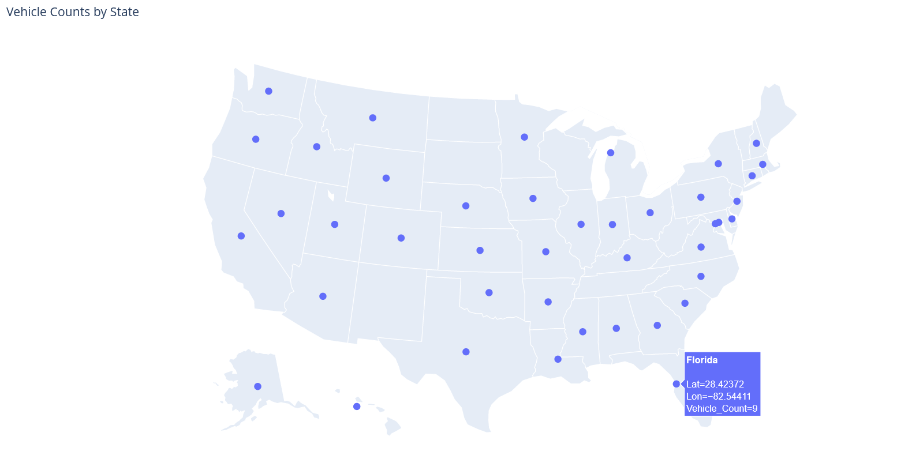
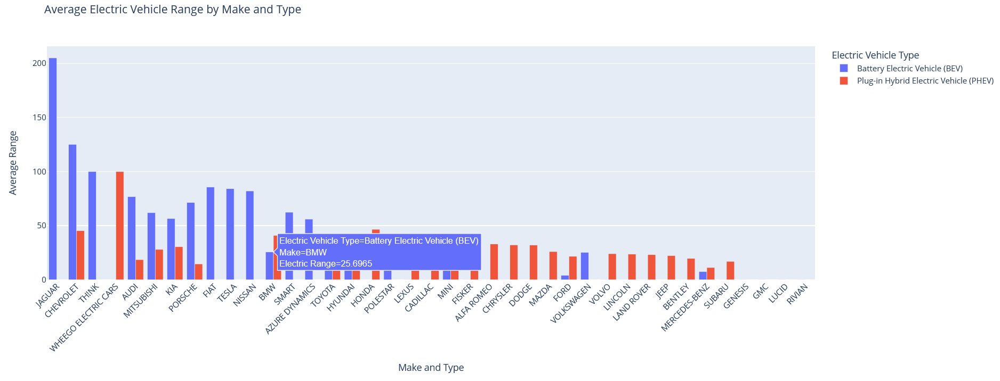
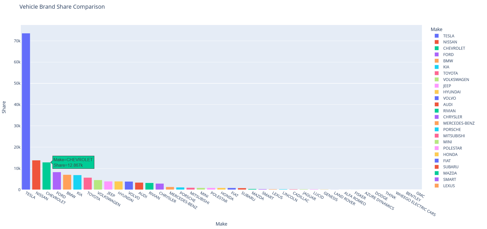
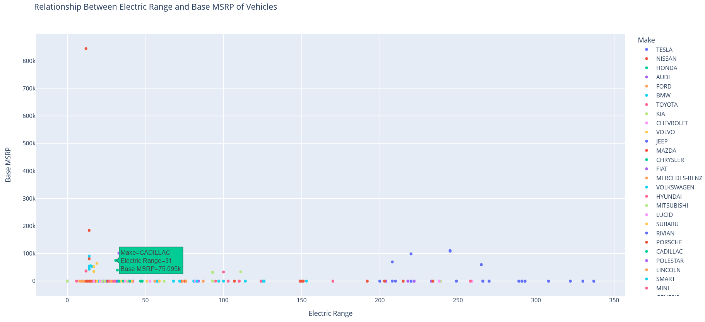

# Vehicle Data Analysis

This Python script is designed to perform various data analysis tasks on vehicle-related data. It includes functions for data preparation, visualization, and analytical insights. Below is an overview of the functionalities provided by this code.

## Features

### Data Loading and Preparation

- Fetches vehicle data from a CSV file hosted online and loads it into a Pandas DataFrame.
- Retrieves information about U.S. states from a public API and stores it in JSON format.
- Cleans and preprocesses the data by removing unnecessary columns and handling missing values.

### Data Visualization

- Generates a scatter plot on a U.S. map to visualize vehicle counts by state.
  
- Creates bar charts to show the average electric vehicle range by make and type.
  
- Produces a bar chart to display the share of vehicle brands in the dataset.
  
- Generates a scatter plot to analyze the relationship between electric range and vehicle base MSRP.
  

### Analytical Functions

- Searches for vehicles with VIN numbers containing a specific digit.
- Filters the dataset to include only electric vehicles.
- Sorts vehicles by model year.
- Groups vehicles by make and provides insights into each brand.
- Counts the number of vehicles in a specific county.
- Performs a price analysis on vehicle base MSRP.
- Filters vehicles eligible for the Clean Alternative Fuel Vehicle (CAFV) program.
- Retrieves data for a legislative district based on user input.
